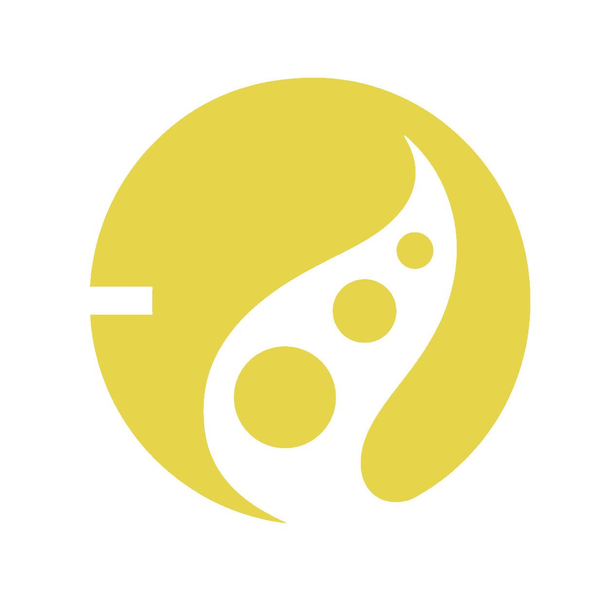

# ParticleLens

<p align="center">
  
</p>

ParticleLens is an open-source particle-size analysis tool for approximately
circular objects in microscope images.

**Use the Web App:** [particlelens.liuzhaohan.com](https://particlelens.liuzhaohan.com)

The Web App runs entirely in the browser. Images are decoded and analyzed on
your device and are not uploaded to ParticleLens or an analysis server. No
Python installation is required.

## What it does

- Detects circular droplets or particles and estimates their diameters.
- Detects a lower-right scale bar or accepts a manual calibration.
- Supports manual add, move, delete, and scale correction.
- Provides count, distribution statistics, and a histogram.
- Exports corrected CSV data and an annotated PNG.
- Works in Chinese and English.
- Caches its browser runtime for repeat visits and offline use after a
  successful first load.

The first visit downloads about 27 MB of pinned Pyodide, NumPy, OpenCV, and
shared detector resources. ParticleLens reports verified downloaded bytes
against the manifest total, then reports each initialization phase. Images over
20 megapixels receive a memory warning and are supported on a best-effort basis.

## Privacy

The hosted Web App has no image-upload endpoint. Detection runs in a Web Worker,
and automated network tests verify that selecting and analyzing an image creates
no outbound image request. Browser extensions, operating-system services, and
manually opened external links are outside the project's control.

For offline or restricted environments, use the Windows release or run the
Python CLI locally.

## Validation and limitations

ParticleLens uses classical computer vision, not a trained scientific model.
The pipeline combines scale-bar detection, contrast preprocessing, OpenCV Hough
circles, edge-supported least-squares fitting, duplicate suppression, and
visible-area calculation.

Release validation covers:

- deterministic synthetic images with clear and weak edges, overlaps, partial
  objects, background gradients, three contrast modes, no scale bar, and no
  particles;
- clearly licensed public microscopy samples documented in
  [`tests/fixtures/public/README.md`](tests/fixtures/public/README.md);
- native Python and browser execution of the same detector core;
- Chrome, Edge-compatible Chromium, Firefox, Playwright WebKit, and a macOS
  Safari smoke test in CI;
- responsive browser processing and memory behavior through 20 MP.

The current validation set does not include private research samples and does
not establish suitability for every imaging modality or scientific decision.
Always review detections and preserve the original data.

## Web development

Requirements: Node.js 22+, Python 3.11+, [npm](https://docs.npmjs.com/), and
[uv](https://docs.astral.sh/uv/).

```powershell
npm ci
uv sync --locked
npm run dev
```

Build the hosted Web App:

```powershell
npm run build:web
```

The build downloads the pinned Pyodide 0.28.3, NumPy 2.2.5, and OpenCV 4.11.0
assets into an ignored local cache, verifies every SHA-256 value, and creates
`dist/web`. Runtime files are not committed.

## Tests

```powershell
uv run ruff check .
uv run pytest -q
npm run lint
npm test
npm run build:web
npm run test:e2e
uv run python scripts/benchmark_20mp.py
```

CI requires the `python-tests`, `frontend-tests`, `browser-parity`,
`pages-build`, and `windows-package` checks before release.

Release pull requests from `development` to `main` publish an authenticated
Cloudflare preview at
<https://development.particlelens.liuzhaohan.com> after CI and CodeQL pass.
The `cloudflare-preview` GitHub environment stores the deployment credentials:

- `CLOUDFLARE_API_TOKEN` is an environment secret created from a dedicated
  Cloudflare token with the **Edit Cloudflare Workers** permission policy.
- `CLOUDFLARE_ACCOUNT_ID` is an environment variable containing the Cloudflare
  account ID.

The preview Worker disables both its `workers.dev` route and generated preview
URLs. Cloudflare Access protects the custom domain.

## Python CLI and local app

The CLI remains the reference batch workflow:

```powershell
uv run python analyze_particles.py "image.jpeg" --out output
uv run python analyze_particles.py "E:\MicroscopeImages\*.jpeg" --out output
```

Start the local browser UI backed by native Python:

```powershell
npm run build:native
uv run python particle_web_app.py
```

Open `http://127.0.0.1:8765`. The local API sends raw image bytes instead of
Base64. Existing CLI arguments remain compatible.

## Windows release

```powershell
.\scripts\build_windows_release.ps1
```

This creates:

```text
release/ParticleLens-Windows-v0.2.0.zip
release/ParticleLens-Windows-OneFile-v0.2.0.exe
release/SHA256SUMS.txt
```

Both packaged launchers run `--self-test` during the release build.

## Contributing

Bug reports, feature proposals, reproducible detection cases, documentation
improvements, and pull requests are welcome. Read
[`CONTRIBUTING.md`](CONTRIBUTING.md) before submitting data or code.

- External feature PRs target `development`.
- Releases use a maintainer PR from `development` to protected `main`.
- Please do not attach private microscope images.
- Detection samples must include a source and compatible license.

See the [issue tracker](https://github.com/martin-lzh/ParticleLens/issues),
[Discussions](https://github.com/martin-lzh/ParticleLens/discussions), and
[`SECURITY.md`](SECURITY.md).

## Project layout

```text
particle_detection_core.py   Shared browser/native detector
analyze_particles.py         CLI and batch exports
particle_web_app.py          Native local HTTP API
particle_app_launcher.py     Windows launcher and self-test
static/                      Vite UI, Worker, and Service Worker
scripts/                     Runtime preparation and release builds
tests/                       Python, browser, and licensed fixtures
```

## Citation and license

Academic users can cite the BibTeX entry in [`CITATION.bib`](CITATION.bib).
ParticleLens is available under the [MIT License](LICENSE).
