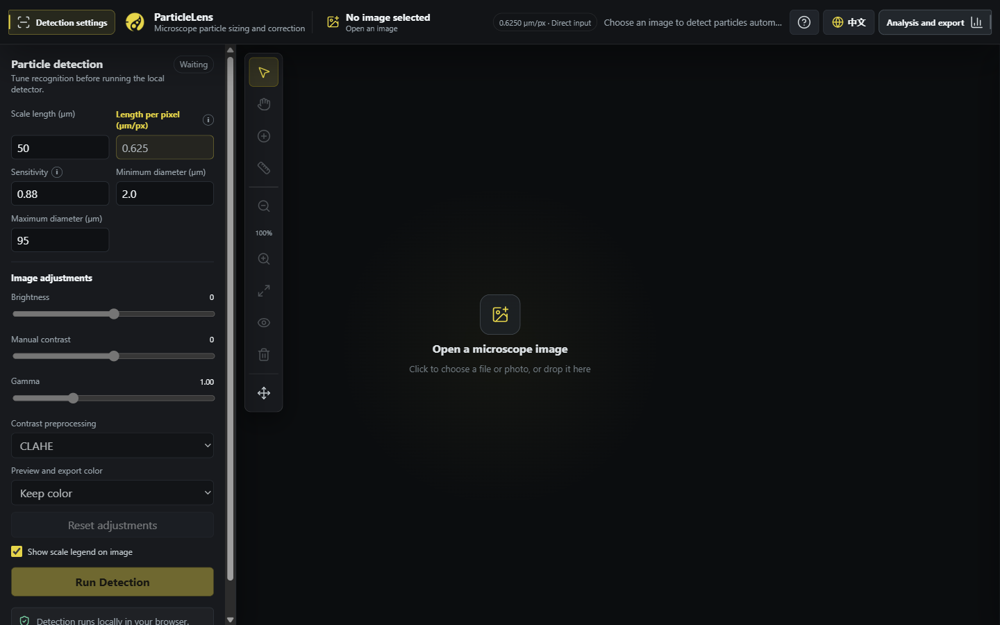
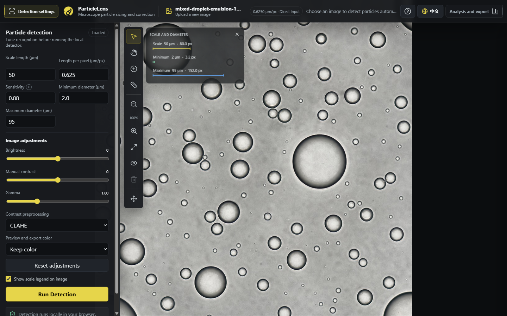
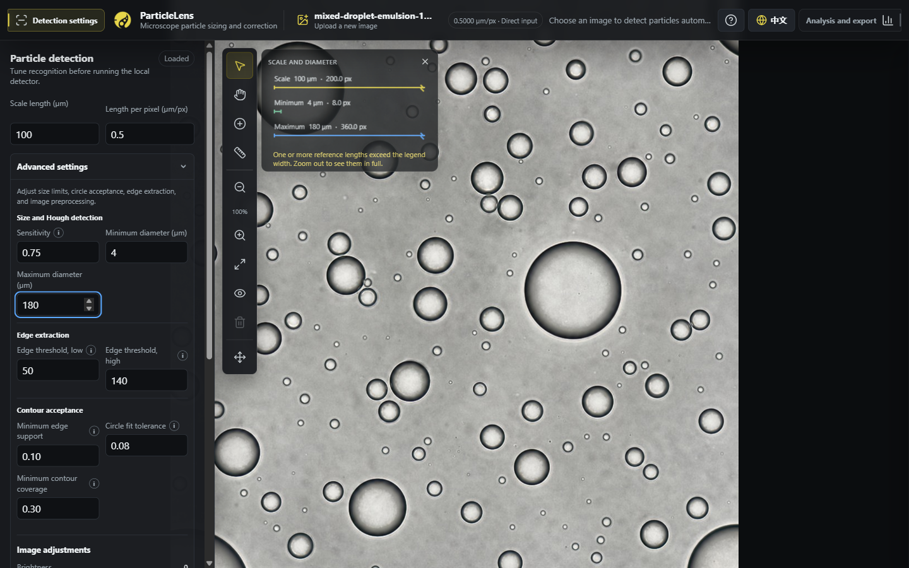
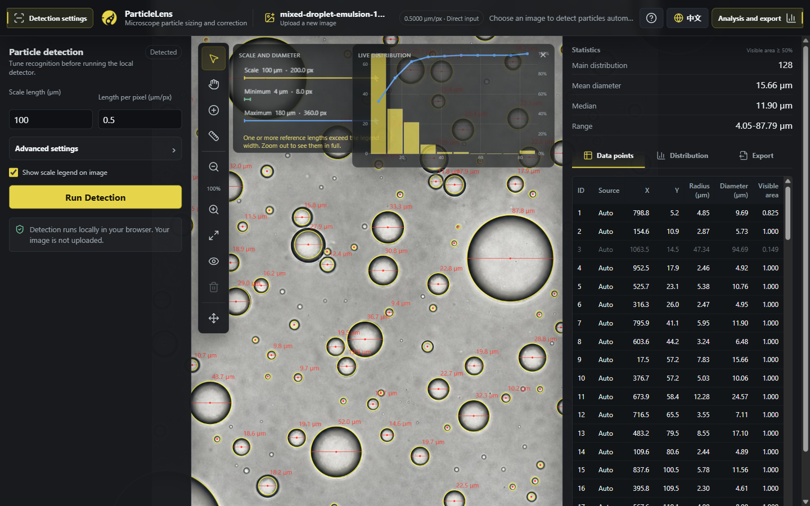
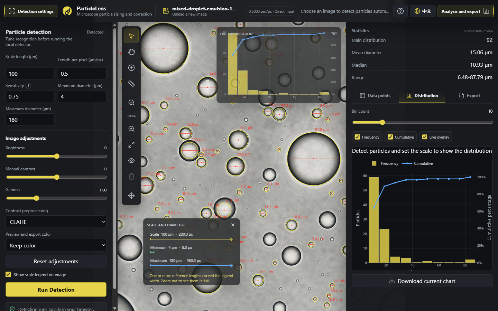
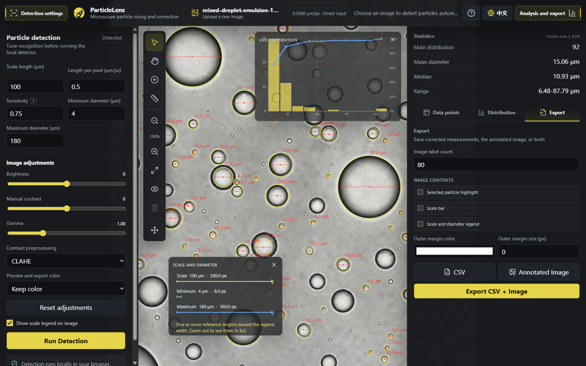

# ParticleLens user guide

This guide walks through a complete analysis with the example image included in
the repository. ParticleLens performs detection in your browser; the selected
image is not uploaded to ParticleLens or an analysis server.

## Start the app

Use the hosted app at
[particlelens.liuzhaohan.com](https://particlelens.liuzhaohan.com), or start a
local development copy:

```powershell
npm ci
uv sync --locked
npm run dev
```

On the first visit, wait for the local detection engine to finish downloading
and initializing. After the workspace appears, the left panel contains
detection settings, the center contains the image and editing tools, and the
**Analysis and export** button opens the results panel.



The globe button in the upper-right corner switches between English and Chinese.

## Analyze the included example

### 1. Open the example image

Select **Open a microscope image** in the center of the workspace. Choose:

```text
tests/fixtures/generated/mixed-droplet-emulsion-1024.jpg
```

You can also drag the image into the workspace. The image name appears in the
top bar after it loads.



This generated image is provided to demonstrate the workflow. It has no scale
bar and no independently reviewed ground-truth annotations, so it must not be
used as evidence of detection accuracy.

### 2. Enter the example settings

Use these values in the **Detection settings** panel. Expand **Advanced
settings** for the sensitivity, diameter, and preprocessing controls:

| Setting | Value |
| --- | ---: |
| Scale length | 100 µm |
| Length per pixel | 0.5 µm/px |
| Sensitivity | 0.75 |
| Minimum diameter | 4 µm |
| Maximum diameter | 180 µm |
| Contrast preprocessing | CLAHE |

Keep the remaining detector controls at their defaults: low and high edge
thresholds of 50 and 140, minimum edge support of 0.10, circle fit tolerance of
0.08, and minimum contour coverage of 0.30.

The example has no scale bar, so **Length per pixel** supplies a tutorial
calibration directly. For real measurements, replace it with the calibration
from the microscope or draw a line over a scale bar of known length. An
incorrect calibration changes every reported diameter.



The diameter limits define the circle sizes to search for. Lower sensitivity
accepts weaker or less-circular edges but can increase false detections; higher
sensitivity is stricter and can miss valid particles.

### 3. Run detection and inspect the result

Select **Run Detection**. Yellow circles mark detected particles, red lines show
their measured diameters, and red labels show diameter values.

Open **Analysis and export** to inspect the summary and the **Data points**
table. With the version and settings shown here, the example produces 128 items
in the main distribution, a mean diameter of 15.66 µm, and a median of
11.90 µm. These values are a walkthrough checkpoint, not a scientific reference;
detector changes may alter them.



The statistics include particles whose visible area is at least 50%. The table
also shows each particle's source, center coordinates, radius, diameter, and
visible fraction.

### 4. Correct detections

Review the whole image before exporting. The vertical toolbar provides the main
editing actions:

- **Select**: select a circle, then drag it to correct its position.
- **Hand**: pan around a zoomed image.
- **Draw circle by diameter**: drag across a missed particle to add it.
- **Redraw scale bar**: draw across a scale of known length to recalibrate.
- **Delete selected**: remove a selected false detection.
- **Fit view**, **Zoom in**, and **Zoom out**: change the view without changing
  the measurements.

The **Scale and diameter** and **Live distribution** overlays are movable. Drag
either overlay by its title bar to keep an important image region visible, or
select its close button to hide it.

Use the question-mark button in the top bar for mouse and touch gestures. If you
change detection or image-adjustment settings, the current circles remain
visible for comparison; select **Run Detection** again to calculate a new
result.

### 5. Review the distribution

Choose the **Distribution** tab to view the diameter histogram and cumulative
percentage line. Adjust **Bin count** to change the grouping without changing
the underlying particle measurements. The chart can also be downloaded as a
PNG.



### 6. Export the corrected analysis

Choose the **Export** tab. You can:

- download the corrected measurements as CSV;
- download an annotated image;
- select **Export CSV + Image** to download both;
- control how many particle labels appear in the image;
- optionally include the selected-particle highlight, a drawn scale bar, or the
  scale and diameter legend; and
- add an outer margin and choose its color.



Keep the original microscope image alongside the exported files so the analysis
can be reviewed or repeated later.

## Use your own image

For a new image, follow the same sequence:

1. Open the image and confirm that its orientation and contrast look correct.
2. Set the physical scale. Enter the microscope calibration in µm/px, or enter
   the known scale-bar length and use **Redraw scale bar** to draw across it.
3. Set minimum and maximum diameters to exclude objects outside the expected
   size range.
4. Choose CLAHE, background correction, or no contrast preprocessing. Brightness,
   manual contrast, and gamma update the preview without overwriting the source
   image.
5. Run detection, inspect every region, and correct missed or false circles.
6. Review the table and distribution, then export the corrected data and image.

ParticleLens uses classical computer vision and may not suit every imaging
modality. Preserve the source image, record the calibration and settings, and
validate the workflow for the intended scientific use.
